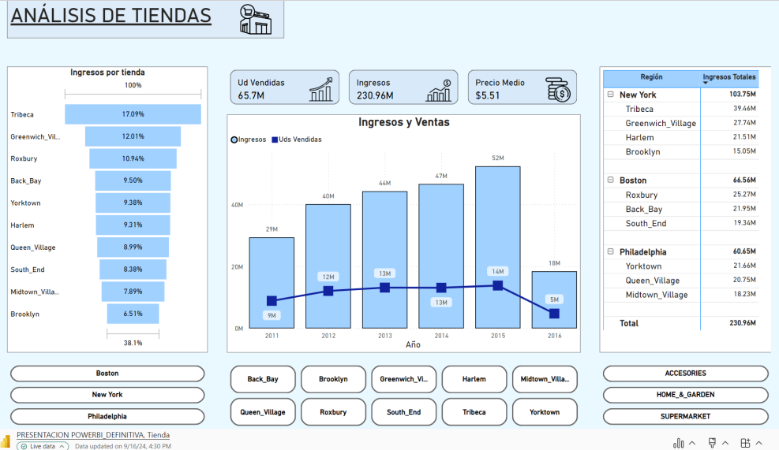

# DS-MARKET

This project represents the final result of my journey to becoming a Data Scientist. Here, I present a comprehensive solution for managing the products across the stores of a company, addressing their specific requests and business needs.

## Objectives:
* Analyze the state of each store, identifying sales trends of products and their evolution, sliced by country and other key factors.
* Detect and group similar products to understand how many groups exist and what they represent.
* Provide accurate forecasts of future sales.
* Forecast inventory demand to ensure optimal supply levels.
* In addition to these objectives, we aim to develop comprehensive visualizations that effectively communicate the analysis conducted, ensuring that insights are clearly   understood and actionable for decision-makers

## Sprint 1: Data Exploration and Preparation

We received three key datasets containing company information: (item_prices, item_sales, and daily_calendar_with_events).
We began with data cleaning and a thorough analysis of the datasets, gaining an understanding of the variables and their structure. We used tools such as Python alongside libraries like "like `numpy`,`pandas`,`matplotlib`,`seaborn`  in development environments like `Visual Studio Code` & `Jupiter notebooks`.
We conducted extensive preprocessing to build the main dataset. This dataset were utilized to develop visualizations that provide a comprehensive view of the company's current status, highlighting the behavior of cities, stores, products, and their categories. 

### Cities current status
  

  
As we can see in the picture there are some slicers at the bottom so make easier to explore de data

There are also Kpis that modify their values where we navigate through data

  

### Shops current status
  

  

### Products behavior
  

  
we tried to identify behavior of products before clustering

  

  

In this table we can see top 20 of best income products. Some of them arrived later than others

  

## Sprint 2: Clustering 

We applied clustering techniques, specifically the K-means algorithm, to identify groups of similar products.
In addition, we created clear and insightful visualizations that helped us better understand the behavior and composition of these clusters

### Cluster overview
  

  

### Cluster groups
  

  

## Sprint 3: Predictive Modeling

We developed a comprehensive visual report to highlight the key insights derived from our data analysis. After evaluating various forecasting models, including ARIMA and skforecast from Sklearn, we selected the most accurate and appropriate approach for the business. Using the chosen model, we implemented sales forecasts to support future planning.

  

### Income forecasting
  

  

### supply_forecasting
  

  

## Results:

Through this project, we achieved:

Clear identification of well-defined product clusters, providing greater clarity on consumption trends.
Accurate sales forecasts that enable efficient product supply planning.
We crafted a storytelling narrative that clearly and effectively communicates the results, emphasizing their relevance for strategic decision-making in the company.

 

